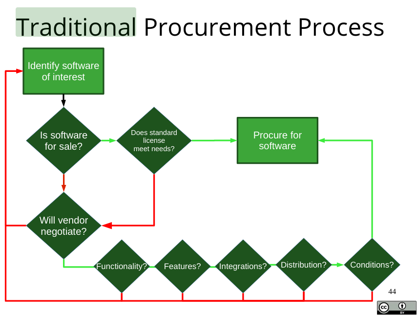

# OSS-test1-cribsheet
Cribsheet for exam 1 of OSS

# Table of contents:

[General Open source and random things](#OSS)

[Git](#Git)

[Documentation](#Documentation)

[Community](#Community)

[Licenses](#License)

[Build Systems](#Build)

# OSS

TODO:

## OSS development

## Random things:

**Regex rules:**

abc…	Letters

123…	Digits

\d	Any Digit

\D	Any Non-digit character

.	Any Character

\.	Period

[abc]	Only a, b, or c

[^abc]	Not a, b, nor c

[a-z]	Characters a to z

[0-9]	Numbers 0 to 9

\w	Any Alphanumeric character

\W	Any Non-alphanumeric character

{m}	m Repetitions

{m,n}	m to n Repetitions

\*	Zero or more repetitions

\+	One or more repetitions

?	Optional character

\s	Any Whitespace

\S	Any Non-whitespace character

^…$	Starts and ends

(…)	Capture Group

(a(bc))	Capture Sub-group

(.\*)	Capture all

(abc\|def)	Matches abc or def


# Git
TODO:

## Some git commands:

[Turner's Git Cheat Sheet](https://github.com/rcos/CSCI-4470-OpenSource/blob/d4e7d27a040963333df71808298eb24c1582fd3a/Modules/02.Git/cheat_sheet_git_final.pdf)

**git add:** Adds a file to be tracked by git. Do this after you edit a file

**git commit:** Commits your changes to your local repository (on your computer)

**git push:** Transfer your commit to the remote repository

**git pull:** Update your local repository with changes made on the remote one

**git checkout:** Allows you to switch to another branch (git checkout branch_name)

**git branch:** Shows the available branches. Create a new one with (git branch branch_name)

**git log:** Shows the history of the repo (commits, merges, etc)

**git status:** Tells you your current branch, and if you have any changes to commit

**git diff:** Shows you the changes made to a file, if there is a difference between your local file and the last commit you have saved

**git tag:** Lists the existing tags. To add a tag to the current commit, do (git tag v1.0). To get details on the v1.0 tag, do (git show v1.0)

**git rebase:** Takes and old branch, and adds it on to another commit as if it were branched off of that one. This is useful when the master branch has progressed since you started working on a feature branch, and you want to add the latest updates from the master branch to your branch. The image below shows a branch being rebased.


**git merge:** Combines branches. Doing (git merge feature_branch) while in the master branch will merge it into the master branch. Git usually handles any conflicts in the files, but if two people changed the same lines there will be conflicts. Conflicts are marked in the file with conflicts, and they look like this:
```
If you have questions, please
<<<<<<< HEAD
open an issue
=======
ask your question in IRC.
>>>>>>> branch-a
```
To resolve them, edit the file and remove the stuff you don't want (like the <<<, ===, \>\>\>, and the code you don't want to keep)


# Documentation
TODO:

# Community
##### Tools to run a community:
- website
- developer mailing list
- version control
- issue tracker

##### Tools for communcation:
- Mail Archives
- Forums
- Questions and Answers as in Stackoverflow
- Blogs, Syndication
- Social Networking, Microblogging
- screen casts
-  videos - youtube/vimeo
- version control system
- Management of Intellectual Property

##### Roles in an open source project:
- writing code
- Documentation Writers
- Translators
- website designers
- GUI designers
- Communications people

##### Particpating in Open Source Community
- Estimate your time commitment
- Check your employment contract.
- Show your enthusiasm

##### Get to Know your community
- Understand how the community communicates
- Understand how the community is governed
- Understand the role of constructive criticism
- Get to know the people
- Understand the communication Channels
- Learn about "Poisonous People"

##### Engage

- Communicate what you are working on
- Acknowledge resources you use and their creators
- Give back
- Plan an exit strategy
- Retire Gracefully

##### Sustainable Open Source

- Reaching sustainability
- Product Development
  - Large market share (support, training, customization, search engines)
  - Hardware companies give out free drivers
  - Software companies who utilize open source components
  - Dual licensing model - open source version and a proprietary version.


##### Non Profit Open Development

- Free Software Foundation
- The Eclipse Foundation
- The Gnome Foundation
- The Mozilla Foundation
- The Python Foundation
- The Linux Foundation


## Markdown

**basic markdown**
```
# title
# subtitle

insert picture: 

hyperlink:

list:

1. item 1
2. item 2

```

## Latex

## Github wiki

# License

Open Source and Free Software
---

**OSS License terms apply with distribution not use**

**10 requirements for Open Source:**

1. **Free Redistribution:** no restriction from selling or giving away the software as a component of an aggregate software distribution. License should not require royalty or fee

2. **Source Code:** Source code must be available, not obfuscated, and easy to modify.

3. **Derivative works:** allows for derivative works under the same terms as the original software

4. **Integrity of the Author's source code:** can restrict in cases of distribution of patch files that modify the code

5. **No discrimination against persons or groups**

6. **No discrimination against fields or endeavor**

7. **Distribution of License:** rights to program apply to all who the program is redistributed without the need for execution of an additional license by those parties

8. **License must not be specific to a product**

9. **License must not restrict other software**

10. **License must be technology-Neutral**

**4 freedoms of Free Software**

  1. Freedom to **run** the program as you with for any purpose
  2. Freedom to **study** how the program works, change it
  3. Freedom to **redistribute** copies to others
  4. Freedom to **distribute modified versions** to others

**Traditional procurement:**



**Open source vs Public domain**

  * ***PUBLIC DOMAIN IS NOT OPEN SOURCE***
    * No owner with public domain
      * Does not require anything to use
        * things like software that was in the public domain being sold back with a proprietary license can happen

**License and characteristics:**

can search more under [tldrLegal](https://tldrlegal.com/)

* **MIT:**
  * characteristics:
    * **Permissive license:** minimal requirements for how the software can be redistributed. **Can** use, distribute, and modify freely. **Must** include copyright and license notice where it is used. **Cannot** hold liable

* **BSD:**
  * characteristics:
    * **Permissive License:** minimal requirements for how the software can be redistributed, so long as BSD copyright and full text of the license. **Cannot** hold liable, or use in trademark

* **GPL:**
  * characteristics:
    * **Copy left:** program is free, but requires all modified and extended versions to be free as well (this case, specifically under the GPL). **can** copy distribute, modify. Must have modifications under GPL. **Cannot** hold liable, or sub license.

* **LGPL:**
  * characteristics:
    * **Lesser:** Some elements of Permissive, and Copy left. Similar to **GPL**, except applications that use this library dont have to be LGPL

* **AGPL:**
  * characteristics:
    * **Copy Left:** Like GPL but distribution also includes the public accessing that software

* **Mozilla**
  * characteristics:
    * **Lesser:** Is copyleft, but not strongly. **Must** make source code changes available under MPL, but can combine MPL software and proprietary, along as MPL is separate files.

* **Apache:**
  * characteristics:
    * **Permissive**: Can do whatever you like, as long as you include required notices.
    * Includes patents provisions with its license
    * Note: Apache 1.1 and 1.0 requires acknowledgment of trademark that 2.0 does not require

**Fake Open Source"**
  * Open washing: saying a product/company is free when it is not. Appearing to be open but using proprietary practices
  * Fauxpen Source: Software that caims to be open source, but lacks full freedoms in the Open source definition
  * Nop-in Source: Software that invokes benefits/values of open source, but places restrictions on users
  * Post open source: "Its on github so its open source"
  * Open core: software that has some open kernel of source, but has everything else as closed or proprietary


# Build

## Compiling Libraries

### Object Files

Object files are an intermediate step in compilation. They are *mostly* machine code, but have additional symbols used by the linker when linking to external libraries.

```bash
cc -c source.c -o object.o
```

### Shared Libraries

Shared libraries are linked **at runtime**

Note: Shared libraries must be compiled as **address independent** objects (`-fPIC`)

```bash
cc -fPIC -c source1.c -o object1.o
cc -fPIC -c source2.c -o object2.o
...
cc -shared -o libshared.so object1.o object2.o ...
cc object.o libshared.so -o binary_out -Wl,-rpath='$ORIGIN'
```


### Static Libraries

Static libraries are linked **at compile time**

```bash
ar qc libstatic.a object1.o object2.o ...
cc object.o libstatic.a -o binary_out
```


## Make

A `Makefile` expresses **targets**, **dependencies**, and **commands**

```makefile
all: hi1 hi2
hi1: hi1.o libhello.so
        cc hi1.o libhello.so -o hi1 -Wl,-rpath='$$ORIGIN'
hi2: hi2.o libhello.so
        cc hi2.o libhello.so -o hi2 -Wl,-rpath='$$ORIGIN'
hi1.o: hi1.c
        cc -c hi1.c -o hi1.o
hi2.o: hi2.c
        cc -c hi2.c -o hi2.o
libhello.so: hello1.o hello2.o
        cc -shared -o libhello.so hello1.o hello2.o
hello1.o: hello1.c
        cc -fPIC -c hello1.c -o hello1.o
hello2.o: hello2.c
        cc -fPIC -c hello2.c -o hello2.o
```

* `all` is a **target**
  * `all` is the default target when the command `make` is ran. I _think_ the `all` target is required for all Makefiles.
* `hi1` and `hi2` are **dependencies** of `all`
  * dependencies can be
    1. targets (eg. `hi1`, `hi2`)
    2. explicitly defined files (eg. `hello1.c`, `hello2.c`)
       - changing an explicitly defined dependency **will** force the target to be rebuilt when `make` is re-ran
    3. implicitly defined files (eg. `hello1.h`, `hello2.h`)
       - changing an implicitly defined dependency **will not** force the target to be rebuilt when `make` is re-ran
* `cc hi1.o libhello.so -o hi1 -Wl,-rpath='$$ORIGIN'` is a **command**


## CMake

CMake is a higher level **abstraction** of `make`, which allows us to generate complex and flexible Makefiles from a relatively simple `CMakeLists.txt`


Example boilerplate `CMakeLists.txt`

```cmake
cmake_minimum_required(VERSION 3.10)

# specify name/version
project(Tutorial VERSION 1.0)

set(CMAKE_CXX_STANDARD 11)
set(CMAKE_CXX_STANDARD_REQUIRED True)

configure_file(TutorialConfig.h.in TutorialConfig.h)
add_executable(Tutorial tutorial.cxx)

target_include_directories(Tutorial PUBLIC
    "${PROJECT_BINARY_DIR}"
    )

```


Here are some examples of high level patterns which can be simplified with CMake


  ### Working with Libraries

```cmake
add_library(library_name [SHARED/STATIC] library.c library.h ...)
add_executable(binary_name, source.c)
target_link_libraries(binary_name, library_name)
```


### Conditionals

```cmake
option(FLAG_NAME "description" [ON/OFF])
if(FLAG_NAME)
	do_stuff()
else()
	do_other_stuff()
endif()
```


### Working with Directories

```cmake
# macro representing the source directory (ie. the one with the CMakeLists.txt)
"${PROJECT_SOURCE_DIR}"
#macro representing the build directory (ie. the one which cmake is run from)
"${PROJECT_BINARY_DIR}"

# include a subdirectory of the directory containing your CMakeLists.txt to the CMake context
add_subdirectory(SubDirectoryName)
```


### Passing Configuration Values Through Headers

```cmake
configure_file(header.h.in header.h)
# tell cmake to add the directory containing header.h.in to our searchpath
target_include_directories(ProjectName PUBLIC
                           DIRECTORY
                           )
```


### Functions/Macros

```cmake
function(function_name arg1 arg2 ...)
	do_stuff()
endfunction(function_name)
```


### Testing

```cmake
enable_testing()

add_test(NAME TestName COMMAND ProgramName Arg1 Arg2 ...)
set_tests_properties(TestName
										PROPERTIES PASS_REGULAR_EXPRESSION "regex"
										)
```


## Regex
Run through this tutorial as a refresher: https://regexone.com/
